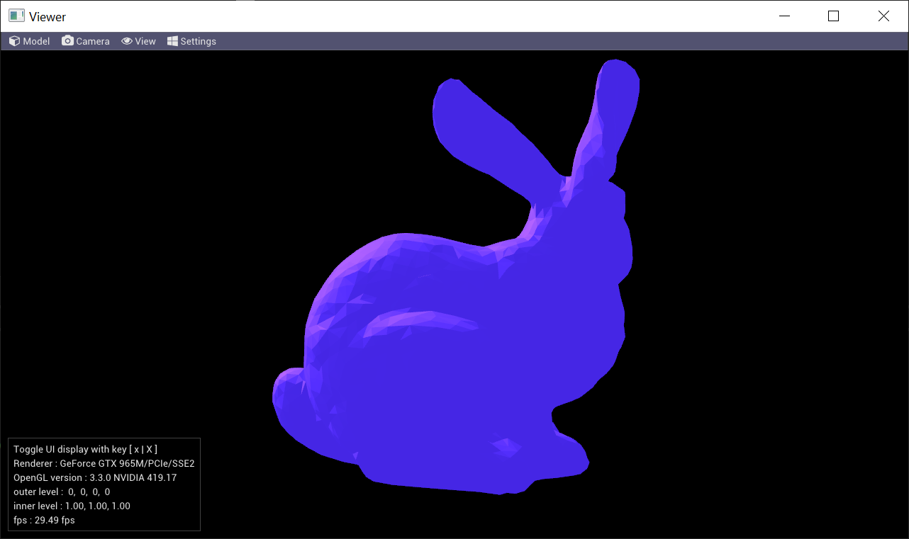

## Tessellation

Applying PN Triangle Tessellation by OpenGL .

## Features 
- [x] Implement PN Triangle Tessellation
- [x] Camera supporting rotate, pan, zoom in / out.
- [x] Cature Color Buffer & save to disk in tga format
- [x] Rendering Image sequence which can be encoded into video by ffmpeg

## Plans
- [x] snap & save to file
- [ ] animation support 

## Screen 
- 

## Credits
- [glew]()
- [glfw]()
- [glm]()
- [tiny obj loader]()
