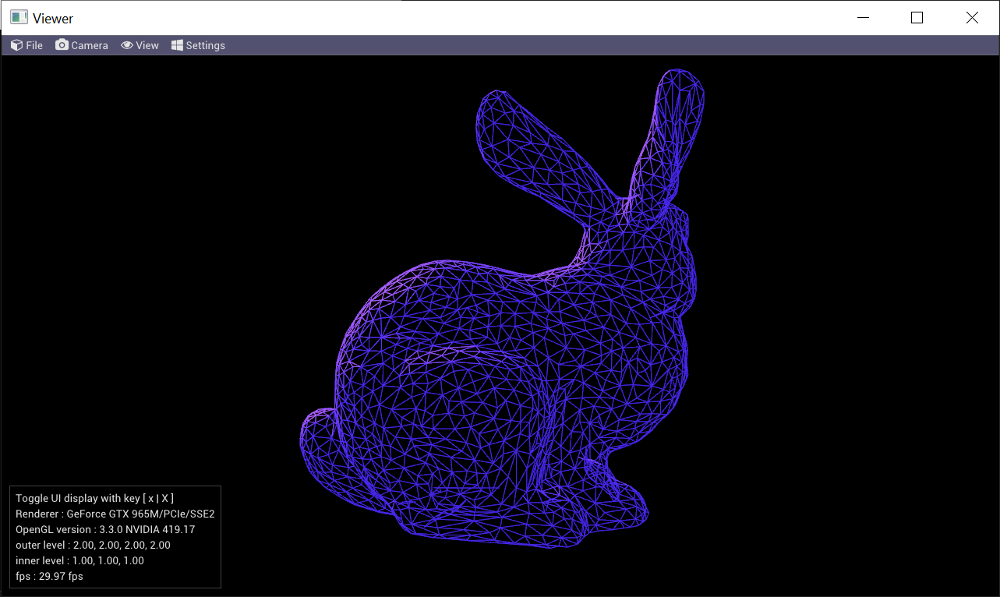

## Tessellation by OpenGL

A PN triangle is a cubic triangular Bezier patch. Control points are merely
depending on the vertex positions and normals of a defining base triangle.
Each PN triangle in a mesh is thus independent of neighboring triangles.

Normals of base triangle shall have different values. If not,normal variation cannot work.
How to ensure no cracks after tessellation. I feel that it is hard to ensure that.

It is to mplement PN Triangle tessellation by OpenGL.

## Features 
- [x] Implement PN Triangle Tessellation
- [x] Camera supporting rotate, pan, zoom in / out.
- [x] Capture Color Buffer & save to disk in tga format
- [x] Rendering Image sequence
- [x] snap & save to file
- [x] Animation support 

## Plans

- [ ]  

## Control 

- Key 'space' : animation loop  rotate -> zoom in -> zoom out -> random 
- Key 't': toggle tesselation
- Key 'w': toggle wireframe 

## Screen 
- 

## Credits
- [glew]()
- [glfw]()
- [glm]()
- [stb image](https://github.com/nothings/stb)
- [tiny obj loader]()
